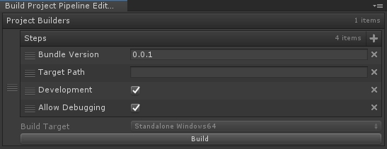

# BuildPipeline
[](https://github.com/dauxio/daux.io/blob/master/LICENSE.md)
[](https://github.com/ted10401/BuildPipeline/releases)

The **BuildPipeline** module provides an easy way to customize the build pipeline.<br/>
The module need to cooperate with [Odin - Inspector and Serializer](https://assetstore.unity.com/packages/tools/utilities/odin-inspector-and-serializer-89041).

## Menu Items
Pipeline/Build Project Pipeline

## Example - Set BuildOptions.Development Step
```csharp
using Sirenix.OdinInspector;
using System;
using UnityEditor;
using UnityEngine;

namespace JSLCore.Pipeline
{
    public static class SetDevelopmentBuildProjectStepUtility
    {
        public static BuildProjectPipeline AddDevelopmentBuildProjectStep(this BuildProjectPipeline projectBuilder)
        {
            return projectBuilder.AddStep(new SetDevelopmentBuildProjectStep());
        }
    }

    [Serializable, HideReferenceObjectPicker]
    public class SetDevelopmentBuildProjectStep : IBuildProjectStep
    {
        [Command("-development")]
        [SerializeField] private bool m_development = true;

        public void Execute(
            BuildTargetPathTracker buildTargetPathTracker,
            BuildOptionTracker buildOptionTracker,
            CommandLineParser commandLineParser)
        {
            commandLineParser?.Parse(this);

            if (m_development)
            {
                buildOptionTracker.Add(BuildOptions.Development);
            }
            else
            {
                buildOptionTracker.Remove(BuildOptions.Development);
            }
        }
    }
}
```

## Example - Build a Windows64 Project
```csharp
using System;
using UnityEditor;
using UnityEditor.Build.Reporting;

namespace JSLCore.Pipeline
{
    public class BuildProjectPipelineWindows64
    {
        public static void Build()
        {
            Build(Environment.GetCommandLineArgs());
        }

        private static void Build(string[] commandLineArgs)
        {
            CommandLineParser commandLineParser = new CommandLineParser(commandLineArgs);

            BuildProjectPipeline projectBuilder = CreatePipeline();
            BuildReport buildReport = projectBuilder.Execute(commandLineParser);
            EditorApplication.Exit(buildReport.summary.result == BuildResult.Succeeded ? 0 : 1);
        }

        [CreateBuildProjectPipeline]
        private static BuildProjectPipeline CreatePipeline()
        {
            return BuildProjectPipeline.Create(BuildTarget.StandaloneWindows64)
                .AddBundleVersionBuildProjectStep()
                .AddTargetPathBuildProjectStep()
                .AddDevelopmentBuildProjectStep()
                .AddAllowDebuggingBuildProjectStep();
        }
    }
}
```

## Exmaple - Create Editor Window
After you have created a new custom build project pipeline, if you want to create an Editor Window, you can add **[CreateBuildProjectPipeline]** attribute to the static method which returns **BuildProjectPipeline** and the Editor Window would create directly.
```csharp
using System;
using UnityEditor;
using UnityEditor.Build.Reporting;

namespace JSLCore.Pipeline
{
    public class BuildProjectPipelineWindows64
    {
        public static void Build()
        {
            Build(Environment.GetCommandLineArgs());
        }

        private static void Build(string[] commandLineArgs)
        {
            CommandLineParser commandLineParser = new CommandLineParser(commandLineArgs);

            BuildProjectPipeline projectBuilder = CreatePipeline();
            BuildReport buildReport = projectBuilder.Execute(commandLineParser);
            EditorApplication.Exit(buildReport.summary.result == BuildResult.Succeeded ? 0 : 1);
        }

        [CreateBuildProjectPipeline]
        private static BuildProjectPipeline CreatePipeline()
        {
            return BuildProjectPipeline.Create(BuildTarget.StandaloneWindows64)
                .AddBundleVersionBuildProjectStep()
                .AddTargetPathBuildProjectStep()
                .AddDevelopmentBuildProjectStep()
                .AddAllowDebuggingBuildProjectStep();
        }
    }
}
```
